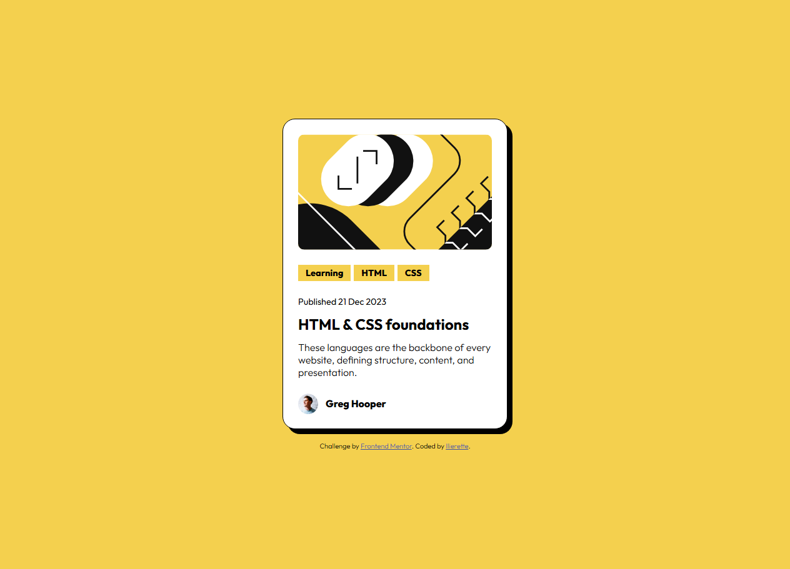

# Frontend Mentor - Blog preview card solution

This is a solution to the [Blog preview card challenge on Frontend Mentor](https://www.frontendmentor.io/challenges/blog-preview-card-ckPaj01IcS). Frontend Mentor challenges help you improve your coding skills by building realistic projects.

## Table of contents

- [Overview](#overview)
  - [Screenshot](#screenshot)
  - [Links](#links)
- [My process](#my-process)
  - [Built with](#built-with)
  - [What I learned](#what-i-learned)

## Overview

### Screenshot

### Links

- [Solution URL]()
- [Live Site URL](https://blog-preview-card-zeta-mocha.vercel.app/)

## My process

### Built with

- Semantic HTML5 markup (or I hope)
- CSS custom properties
- BEM
- Mobile-first workflow

### What I learned

BEM in practice, better semantic
